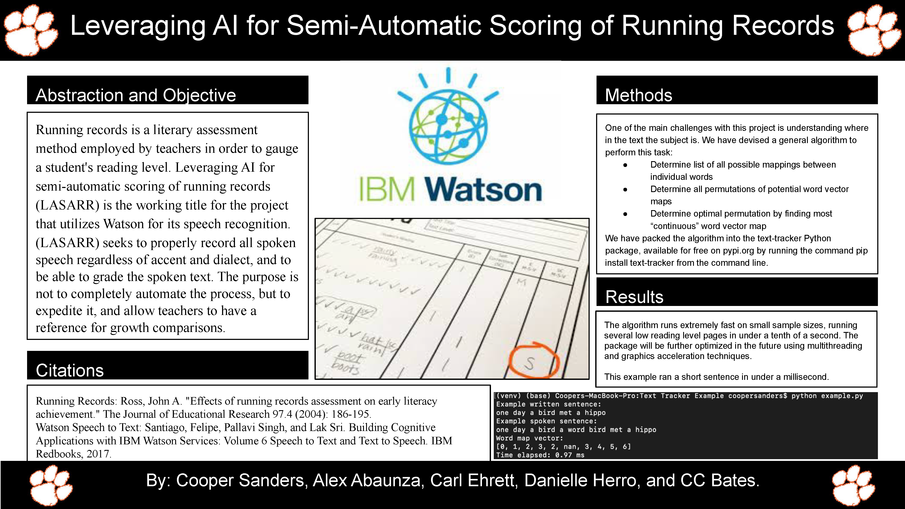

# Initial page

## Abstract

Running records is a literary assessment
 method employed by teachers in order to gauge
 a student's reading level. Leveraging AI for
 semi-automatic scoring of running records
 \(LASARR\) is the working title for the project
 that utilizes Watson for its speech recognition.
 \(LASARR\) seeks to properly record all spoken
 speech regardless of accent and dialect, and to
 be able to grade the spoken text. The purpose is
 not to completely automate the process, but to
 expedite it, and allow teachers to have a
 reference for growth comparisons.

## Attributions

This project was started under the IBM Watson in the Watt Creative Inquiry at Clemson University. The faculty lead for this project is Dr. Carl Ehrett who is working with our research partners, Dr. Danielle Herro and Dr. Celeste C. Bates who work in the College of Education.

## Github Repository

To access the GitHub Repository, click on [this link](https://github.com/cehrett/running_records/blob/master/processs_running_record_update.ipynb).

