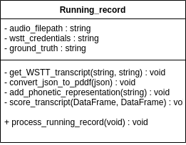

# Running Records Class

The Running Records class is the framework we use for processing and scoring Running Records. When instantiating a `Running_record`, one must include the `audio_filepath` that links to the recording of the child, `wstt_credentials` which we use to authenticate into the IBM Cloud, and `ground_truth`, which is the string transcript of our actual text. Once these attributes are loaded into our `Running_record`, we can use our private methods, as detailed in **Processing a Running Record** to score our 











