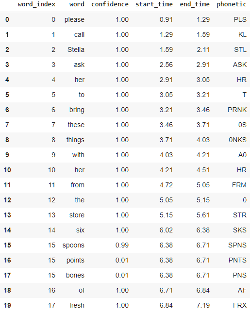

# Transcribing a Running Record with Watson Speech-To-Text

## Watson's Involvement

For this project, we will be using IBM Cloud's Watson Speech-to-Text service in order to transcribe the child's audio into actual text that can be compared to a ground truth.

### Training the Model

In order to transcribe the audio recordings of the children reading audio, each of our research team members transcribed 7-9 recordings of children completing a Running Record exam. Each of these exams came from a diverse range of schools in South Carolina, with all of them being tested against the text **Old Man Moss**. By transcribing these audio recordings by hand, we were able to feed these recordings into a custom Watson Speech-To-Text Model that will be trained on the children's readings. As a result, our hope is that we can develop a baseline in seeing if Watson can accurately transcribe speech to text.

When developing these transcripts, we made sure to account for each of our team members' individual styles of transcribing audio. In order to overcome this, each transcription was "cleaned" by a second team member in order to iron out any issues. Additionally, for our first round of training we chose to remove the %HESITATION symbols from our human-generated transcripts to reduce the potential strain on our word-error calculations.



## Implementing the Model

With the model now trained, we can now implement our model and transcribe new recordings of the child's audio. This can be done by passing audio files to the custom-trained model. When running the model, we also ask it to return all of its hypotheses. In other words, if it believes there is a chance that another word that satisfies the criteria, it will also suggest that word. This results in an output similar to this:



.png)







In this example transcript, we see that it provides multiple hypotheses for the word at index 15 \(spoons, points and bones\). This will be helpful for investigating errors our model makes in transcription.

